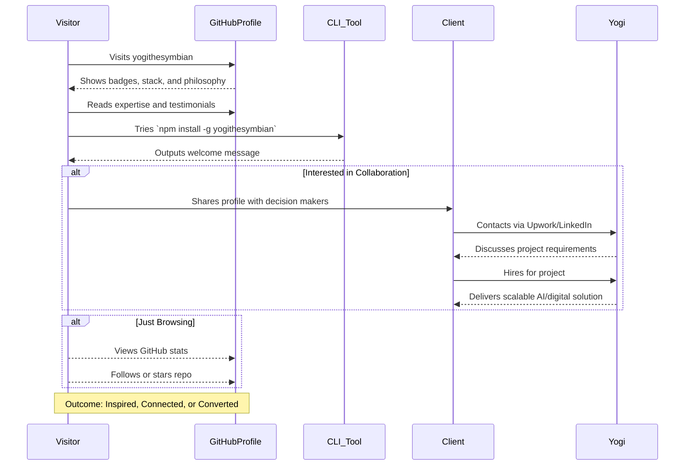
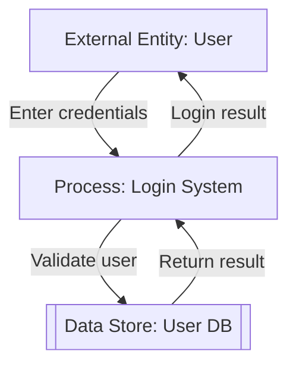
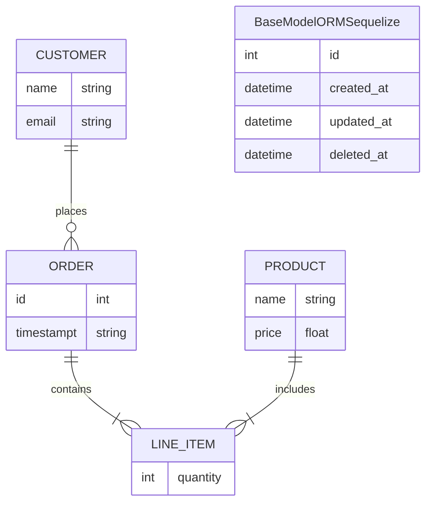

<!--
/**
 * @cgr Generate a sequence diagram for this checkout process.
 * Include description between Stack Skills, Badge, and Client Say
 */
-->
# Hi there! 👋 I'm Yogi - Full-Stack Problem Solver

[](https://github.com/yogithesymbian/yogithesymbian)
[](https://github.com/yogithesymbian)
[](https://www.npmjs.com/package/yogithesymbian)
[](#)
[](https://crates.io/crates/yo_netwatch)


<div align="center">
  
</div>

---

## 🚀 Quick Install & Try

```bash
npm install -g yogithesymbian
yogithesymbian
# Welcome to yogithesymbian special page!
```

## 💼 What Clients Say

<div align="center">
<table>
<tr>

<td align="center" width="33%">

<br><strong>"Complete digital transformation"</strong>
<br><em>Large scale - Total overhaul</em>
</td>
<td align="center" width="33%">

<br><strong>"Yogi & his team are thereal deal!"</strong>
<br><em>E-commerce</em>
</td>
<td align="center" width="33%">

<br><strong>"6 landing pages delivered"</strong>
<br><em>Consumer Brand - Perfect execution</em>
</td>
</tr>
</table>
    
</div>

---

## 🎯 Current Focus & Expertise

<div align="center">

### 🔥 Primary Stack
[](https://nextjs.org/)
[](https://www.typescriptlang.org/)
[](https://vuejs.org/)
[](https://nodejs.org/)

### 🛠 Previous Expertise (Still Sharp!)
[](https://flutter.dev/)
[](https://laravel.com/)
[](https://kotlinlang.org/)
[](https://www.java.com/)
[](https://swift.org/)
[](https://www.gnu.org/software/bash/)
<br/>Provider • Bloc • Getx • Riverpod • Domain-Driven Design (DDD)

</div>

---

## 💡 My Development Philosophy

<div align="center">

</div>

> **"A developer with real projects across diverse languages proves they don't rely on a single tool—they adapt to any environment, focusing on solving problems, not just writing code."**

**The Multi-Language Story:**
Imagine a developer applying for a position at a tech company. The hiring manager asks, "Why so many languages?"

*"Each language served a purpose: Python for data analysis to improve marketing strategies, JavaScript/Typescript for enhanced user experiences, Java/Kotlin for streamlined mobile operations, and Node.js/Go for high-performance backends handling millions of transactions. These experiences taught me that the tool is secondary—what matters is solving the problem effectively."*

---

## 🏢 My Workspace

<div align="center">
<table>
<tr>
<td align="center">

<br>


</td>
</tr>
</table>
</div>

---

## 📊 GitHub Analytics

<div align="center">

</div>

<div align="center">
<table>
<tr>
<td>

</td>
<td>

</td>
</tr>
</table>
</div>

---

## 🤝 Let's Connect & Collaborate

<div align="center">

[](https://www.upwork.com/freelancers/~0170c41ef45390f246?mp_source=share)
[](https://www.linkedin.com/in/yogi-arif-widodo/)

### 💬 Currently Open For:
- 🚀 Full-stack development projects
- 🤝 Collaboration on innovative solutions
- 📈 Scaling businesses through technology
- 🎯 AI-powered application development

</div>

---

## ☕ Support My Work

<div align="center">

If you find my projects helpful, consider supporting my open-source contributions!

[](https://ko-fi.com/R6R3LMURG)

</div>

---

<div align="center">

**💼 Pronouns:** yogithesymbian  
**⚡ Fun Fact:** HRD Dreams & Building the Future  
**🎯 Mission:** Turning complex problems into elegant solutions

<details>
<summary>🎉 Thanks for visiting my profile!</summary>
<br>
<div align="center">

<p><strong>Thanks for letting me share my journey with you!</strong></p>
<p><em>Ready to build something amazing together? Let's connect!</em></p>
</div>
</details>

</div>

---

<div align="center">

</div>





